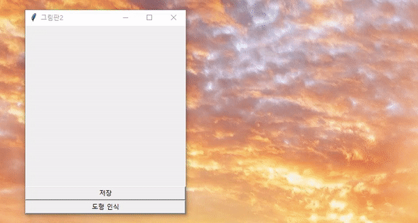
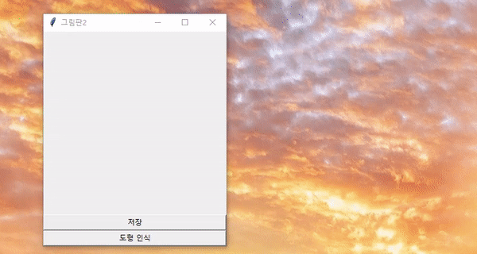
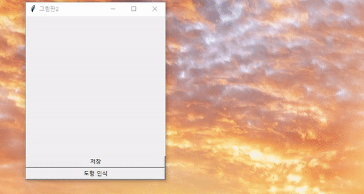
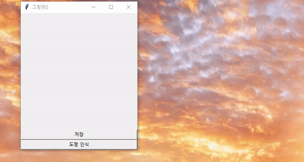

# Detect Shapes in painting

Python OpenCV를 활용해 그림판에 그린 그림에서 도형을 검출하는 프로그램

저장 버튼을 누르면 `capture.png`로 저장하고
해당 이미지를 불러와서 외곽선 검출과 원 검사를 한다.

## Triangle
---

## Rectangle
---

## Pentagon
---

## Hexagon
---

## Circle
---

- 외곽선 검출으로는 원을 검사할 수가 없다. 
따라서, 원은 따로 검사해준다.

## 동작방식
---

#### 외곽선 검출
1. 도형을 그리고 파일로 저장합니다. 
2. 그림을 불러오고 그레이 스케일로 변환하고, 이진화 시켜줍니다. 
3. 검과 흑이 분리된 상황에서 백의 외곽선을 이루는 점들을 추출합니다.
4. 해당 점들을 직선으로 근사화 합니다.
5. 직선의 개수로 도형을 판단합니다.

#### 원
1. 위와 같은 과정으로 도형을 판단하고, 만약 해당되지 않는다면, 허프 원 변환(Hough Circle TransForm) 알고리즘을 활용해 원을 검출합니다.
2. 중심점(a,b)와 가장자리의 좌표를 원의 방정식에 대입해 반지름을 구합니다.
3. 중심점과 반지름을 통해서 원을 그리는 것으로 원을 판단합니다.

## 개선안
---
- 원은 외곽선을 이루는 점의 개수를 근사화한 직선으로는 판단할 수가 없어서 허프 원 변환이라는 알고리즘을 새로 사용해야 했다.

- 곧은 직선을 가진 도형을 판단하는 것보다 사용자가 그린 그림을 프로그램 상에서 조정하여 판단하는 과정을 구현하는 것이 어려움. 따라서, 해당 설정값 조절해야함.

- 점을 연속해서 그리는 방식보다는 점과 점 사이를 칠하는 방식으로 바꿔야함.

